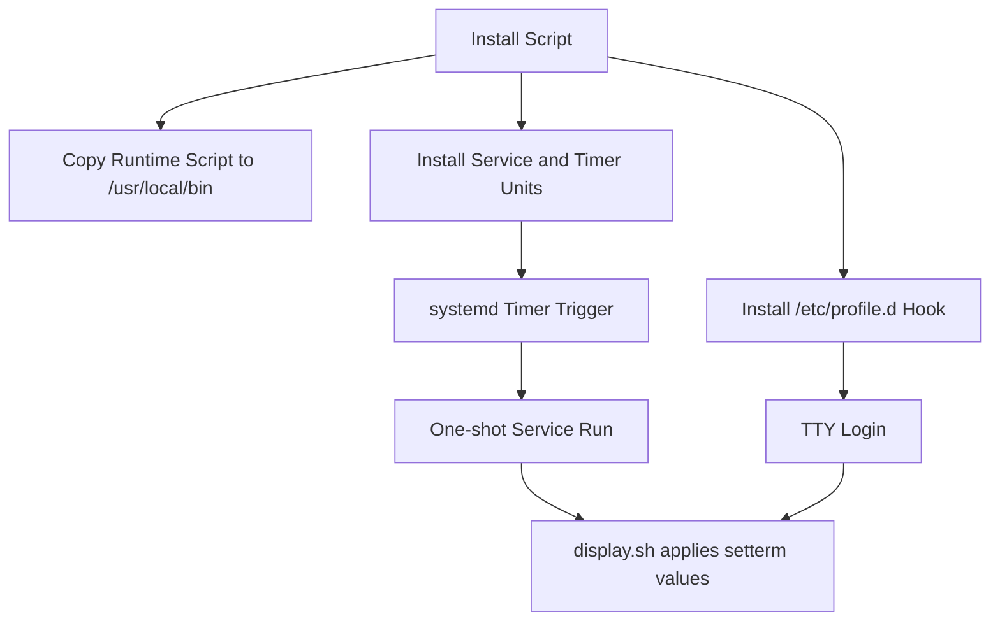
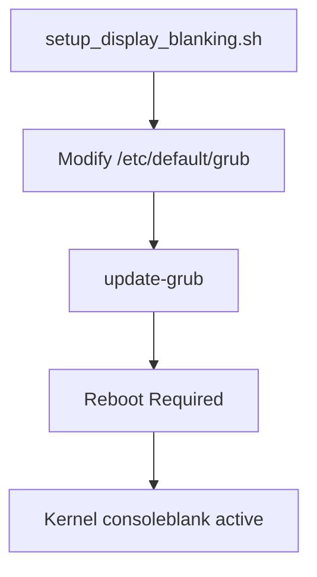

# Architecture — WATCHDOG Display Blanking System

| Status | Date       | Project Version |
|--------|------------|-----------------|
| Draft  | 2026-05-26 | 0.0.1           |

## Purpose

WATCHDOG configures Linux console display blanking and power-down behavior, primarily for Ubuntu Server style deployments where TTY behavior is preferred over desktop power-management tooling.

The repository currently contains two independent blanking strategies:

- Runtime `setterm` strategy: applies blank/powerdown values (3/6 minutes) via script, systemd service/timer, and profile hook.
- Boot-time kernel strategy: configures `consoleblank=120` (2 minutes) via GRUB and reboot.

## Scope and Boundaries

In scope:

- Scripted installation, removal, repair, and status tooling.
- systemd one-shot service and periodic timer.
- TTY-focused behavior and diagnostics.

Out of scope:

- Desktop environment power management (GNOME/KDE/XFCE).
- Cross-distro init systems without systemd.
- Formal test harness/CI pipelines.

## Component Inventory

### Core Runtime Components

- `source/display.sh`: applies `setterm --blank 3 --powerdown 6`.
- `source/display-watchdog.service`: systemd oneshot unit that executes installed runtime script.
- `source/display-watchdog.timer`: periodic trigger (boot delay + 5 minute cadence).
- `source/display-profile.sh`: login-time application in TTY sessions only.

### Lifecycle Components

- `source/install.sh`: installs script/unit/timer/profile and activates timer.
- `source/uninstall.sh`: disables/stops units and removes installed artifacts.
- `source/repair.sh`: reinstalls runtime assets and reactivates timer.

### Diagnostic/Verification Components

- `source/status.sh`: runtime environment and service status summary.
- `source/server-test.sh`: short-lived behavioral test for server contexts.
- `source/countdown.sh`: visual 3-minute countdown helper.
- `source/ssh-info.sh`: explains SSH vs local console behavior.

### Alternate Boot-Parameter Components

- `source/setup_display_blanking.sh`: edits GRUB to add `consoleblank=120`.
- `source/check_display_blanking.sh`: validates GRUB and running kernel parameter state.

## High-Level Flow

Boot-parameter path runs separately:

## Runtime Data and Control Characteristics

- Control plane is shell-script driven.
- Service execution model is idempotent and one-shot.
- Timer cadence is fixed at 5 minutes after boot.
- Login hook applies settings only when session is local TTY (not SSH).
- Operational feedback relies on console logs and `systemctl` output.

## Deployment Model

- Source files live in `source/`.
- Installation copies to system locations under `/usr/local/bin`, `/etc/systemd/system`, and `/etc/profile.d`.
- Scripts assume root privileges and GNU/Linux userland utilities.

## Assumptions

- Host uses systemd.
- `setterm` is available and meaningful for target session.
- TTY session exists for direct console behavior.
- Operator is comfortable running privileged shell scripts.

## Current Architectural Risks

1. Strategy split without orchestration: `setterm` (3/6 min) and `consoleblank` (2 min) are both present but unmanaged as one policy.
2. Timeout inconsistency across docs/scripts: user-facing messaging is not consistently aligned.
3. Service context vs TTY context: `setterm` efficacy depends on execution context; timer runs may not always map to an interactive console.
4. Limited automated verification: no CI-level tests or post-install assertions beyond command success.

## Recommended Near-Term Evolution

1. Choose a primary blanking strategy (runtime `setterm` vs kernel `consoleblank`) and make the other optional/explicit.
2. Centralize timeout values in one shared configuration source consumed by scripts.
3. Add non-interactive verification checks to confirm effective runtime behavior after install.
4. Split user docs by mode (server TTY, desktop, remote administration) to reduce operational ambiguity.

## Traceability Pointers

- Operational README: `README.md`
- Code review cycle: `docs/code-review/001-2026-05.md`
