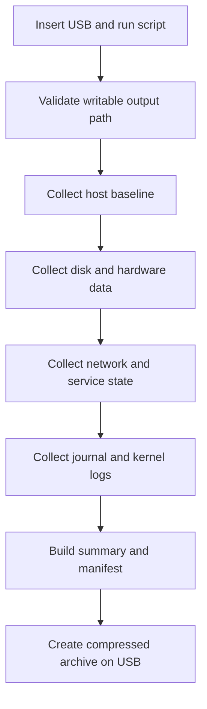

# ADR 001 — USB Offline Ubuntu 24 Server Diagnostics

| Status | Date       | Project Version |
|--------|------------|-----------------|
| Draft  | 2026-05-26 | 0.0.1           |

## Context

Target systems may be offline, unstable, or partially degraded (for example, repeated boot-time disk errors). In this state, remote troubleshooting is limited or unavailable, and ad-hoc command collection is inconsistent.

A portable, repeatable diagnostic workflow is needed to:

- Run directly on Ubuntu Server 24 hosts with no internet access.
- Execute from a USB drive without requiring package downloads.
- Capture broad diagnostics to support root-cause analysis.
- Save results back to the USB drive for transfer to another machine.
- Report service health clearly, including both working and failed units.

## Decision

Implement a standalone shell script named `collect-diagnostics.sh` that is distributed and executed from a USB drive.

The script will produce a timestamped diagnostic bundle on the USB drive and collect the following categories:

1. System health and baseline state.
2. Disk and filesystem status.
3. Hardware health and inventory.
4. Networking configuration and reachability clues.
5. Service inventory with explicit healthy and unhealthy lists.
6. Recent and relevant system logs.

The script must degrade gracefully when commands are missing and continue collection wherever possible.

## Why this decision

- Works in disconnected environments.
- Reduces operator error by standardizing data capture.
- Produces consistent artifacts across multiple incidents.
- Enables asynchronous triage by engineering teams after USB transfer.

## Scope

In scope:

- Ubuntu Server 24.x.
- Bash-based implementation with commonly available tools.
- Non-destructive data collection.
- Root-executed collection model (script is run with root access).

Out of scope:

- Automatic remediation or repair actions.
- Internet-based uploads.
- Interactive ncurses or GUI tools.

## Data to Collect

### Host and OS

- Hostname, uptime, kernel, distro release, boot parameters.
- Date/time, timezone, and clock sync status.
- CPU, memory, load, process summary.

Suggested commands:

- `uname -a`, `hostnamectl`, `uptime`, `lsb_release -a` (if present), `cat /etc/os-release`
- `free -h`, `vmstat`, `top -b -n 1`

### Disk and Filesystem Health

- Block device inventory and mount points.
- Filesystem usage and inode usage.
- UUIDs, partition layout, and fstab references.
- Kernel and journal messages related to I/O errors.
- SMART health when available.

Suggested commands:

- `lsblk -f`, `blkid`, `fdisk -l`, `df -hT`, `df -i`, `findmnt`, `cat /etc/fstab`
- `dmesg -T` filtered for disk and I/O terms
- `journalctl -b -p warning..alert`
- `smartctl -a /dev/<disk>` where `smartctl` exists

### Hardware Health and Inventory

- CPU model, memory topology, PCI and USB devices.
- Thermal and sensor data if available.
- ACPI and power-related state.

Suggested commands:

- `lscpu`, `lsmem`, `lspci -nn`, `lsusb`, `dmidecode` (if root)
- `sensors` if available

### Networking

- Interface state, addresses, routes, DNS config.
- Link and socket summary.
- Firewall state and network service status.

Suggested commands:

- `ip addr`, `ip link`, `ip route`, `resolvectl status` or `cat /etc/resolv.conf`
- `ss -tulpen`, `nft list ruleset` or `iptables -S` if present
- `networkctl`, `nmcli` (if present)

### Services Working and Not Working

- Running services.
- Failed services.
- Services in degraded or activating states.
- Boot critical chain for startup delays/failures.

Suggested commands:

- `systemctl list-units --type=service --state=running`
- `systemctl list-units --type=service --state=failed`
- `systemctl --failed`
- `systemctl list-units --type=service --state=activating`
- `systemd-analyze blame`, `systemd-analyze critical-chain`

### Logs

- Current boot journal and previous boot journal (if available).
- Kernel ring buffer.
- Focused log extraction for storage, filesystem, and service failures.

Suggested commands:

- `journalctl -b`, `journalctl -b -1` (if previous boot exists)
- `journalctl -u <service>` for key services
- `dmesg -T`

## Output Structure

The script writes to a timestamped directory on the USB drive, for example:

- `diagnostics/<hostname>/2026-05-26_1530/summary.txt`
- `diagnostics/<hostname>/2026-05-26_1530/system/*.txt`
- `diagnostics/<hostname>/2026-05-26_1530/disk/*.txt`
- `diagnostics/<hostname>/2026-05-26_1530/hardware/*.txt`
- `diagnostics/<hostname>/2026-05-26_1530/network/*.txt`
- `diagnostics/<hostname>/2026-05-26_1530/services/*.txt`
- `diagnostics/<hostname>/2026-05-26_1530/logs/*.txt`

A final compressed archive should be generated:

- `diagnostics/<hostname>/2026-05-26_1530.tar.gz`

## Security and Safety Constraints

- Read-only diagnostics only; no automatic repairs.
- Redact or separate potentially sensitive data where practical.
- Avoid collecting secret material unless explicitly requested.
- Include a manifest listing every command executed.

## Implementation Readiness Criteria

The implementation must satisfy the following concrete requirements.

### USB Path Detection and Selection

- The script must accept an explicit output path argument (for example `--output-root /media/usb`).
- If no argument is provided, auto-discovery must choose a writable removable mount from common paths (`/media`, `/run/media`, `/mnt`).
- If multiple writable removable targets are found, the script must:
  - print all candidates,
  - require explicit selection via argument,
  - exit without collecting data.
- If no writable USB target is found, exit with a hard-failure code.

### Root Execution Contract

- The script must require `EUID=0` and fail fast with a clear message if not root.
- Root-only commands (for example SMART and full journal access) are mandatory in root mode and should be logged as failed if unavailable.

### Output Contract (Required Files)

Each run must create:

- `summary.txt` (human-readable overview and critical findings)
- `manifest.txt` (ordered list of every command attempted)
- `errors.txt` (all command failures with exit code and stderr path)
- `meta/run-info.txt` (script version, hostname, kernel, start/end time, duration)
- `meta/exit-code.txt` (final run status code)

The following directories are required and must contain at least one command output file each:

- `system/`
- `disk/`
- `hardware/`
- `network/`
- `services/`
- `logs/`

### Size, Time, and Compression Limits

- The script must support configurable defaults:
  - per-command timeout default: 30s,
  - long-log timeout default: 120s,
  - maximum single output file size default: 50MB,
  - maximum journal lines per capture default: 20000.
- If limits are reached, the script must truncate safely and note truncation in both `summary.txt` and `errors.txt`.
- Archive creation (`tar.gz`) is required even when partial failures occur.

### Redaction Policy

By default, redact or omit:

- full MAC addresses (keep vendor prefix only),
- public IP addresses on non-RFC1918 interfaces,
- serial numbers from `dmidecode` and storage identifiers,
- host SSH private key material and secrets under `/etc/ssh` and `/etc/*secret*`.

If redaction is applied, record rules used in `meta/redaction-rules.txt`.

### Exit Code Semantics

- `0`: all mandatory collection groups succeeded and archive created.
- `1`: partial success (one or more mandatory commands failed) with archive created.
- `2`: initialization failure (no writable USB target, cannot create output tree, or not root).
- `3`: fatal runtime failure before archive stage.

### Service Health Reporting Contract

- Service outputs must include explicit files for:
  - running services,
  - failed services,
  - activating services,
  - systemd degraded/failed summary.
- `summary.txt` must include a top-level service health section with counts for running, failed, and activating units.

### Disk and Boot Error Prioritization

- `summary.txt` must include a Critical Findings section that surfaces:
  - I/O errors from current boot logs,
  - filesystem mount failures,
  - read-only remount events,
  - SMART overall-health failures when available.

## Operational Flow

## Consequences

Positive:

- Faster triage for offline incidents.
- Standardized evidence set across hosts.
- Better visibility into disk, service, and startup failures.

Negative:

- Output can be large on systems with extensive logs.
- Some commands may require root privileges for full detail.
- Tool availability differs by host image, requiring fallbacks.

## Implementation Notes

- Script should use strict mode where appropriate (`set -u`, `set -o pipefail`) while allowing best-effort command execution blocks.
- Each command should write to a dedicated file and capture stderr.
- Missing command handling should be explicit and logged as "not available".
- Use a wrapper function for command execution that records start/end timestamps, exit code, timeout state, output file, and stderr file into `manifest.txt`.
- Include deterministic filenames for each command output to make diffing between runs easy.
- Provide a concise `summary.txt` with detected critical issues, including:
  - disk I/O errors
  - failed services
  - mount failures
  - filesystem full conditions

## Status and Follow-up

This ADR is accepted for implementation planning once reviewed.

Planned follow-up artifacts:

1. Script implementation in `tools/collect-diagnostics.sh`.
2. Job aid for USB execution workflow in `docs/job-aid/`.
3. Example sanitized output bundle format documentation in `docs/performance/`.
